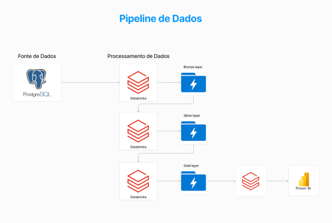

---
hide:
  - navigation
---

# Pipeline de Dados



## Introdução

Nesta página, vamos explorar a pipeline de dados desenvolvida para a transportadora, abordando como foi estruturada e as etapas envolvidas desde a coleta até a entrega de dados prontos para análise.

## Estrutura da Pipeline

A pipeline de dados foi organizada em três camadas principais: Bronze, Silver e Gold. Cada camada desempenha um papel específico na preparação e transformação dos dados.

### Conectando Azure ADLS Gen2 no Databricks

#### Definindo storage account e sas key

```python
storageAccountName = "datalake7a68c04c876ba15d"
sasToken = dbutils.secrets.get(scope="sas-token", key="sas-tkn")
```

#### Definindo uma função para montar um ADLS com um ponto de montagem com ADLS SAS

```python
def mount_adls(blobContainerName):
    try:
      dbutils.fs.mount(
        source = "wasbs://{}@{}.blob.core.windows.net".format(blobContainerName, storageAccountName),
        mount_point = f"/mnt/{storageAccountName}/{blobContainerName}",
        extra_configs = {'fs.azure.sas.' + blobContainerName + '.' + storageAccountName + '.blob.core.windows.net': sasToken}
      )
      print("OK!")
    except Exception as e:
      print("Falha", e)
```

#### Montando todos os containers

```python 
mount_adls('landing-zone')
mount_adls('bronze')
mount_adls('silver')
mount_adls('gold')
```

#### Mostrando os pontos de montagem no cluster Databricks

```python
display(dbutils.fs.mounts())
```

### Transformações de dados

#### Mostrando todos os arquivos da camada landing-zone

```python 
display(dbutils.fs.ls(f"/mnt/{storageAccountName}/landing-zone"))
```

#### Gerando um dataframe para cada arquivo a partir dos arquivos CSV gravado no container landing-zone do Azure Data Lake Storage

```python 
df_agendamentos = spark.read.option("infeschema", "true").option("header", "true").csv(f"/mnt/{storageAccountName}/landing-zone/Agendamentos.csv")
df_cargas = spark.read.option("infeschema", "true").option("header", "true").csv(f"/mnt/{storageAccountName}/landing-zone/Cargas.csv")
df_clientes = spark.read.option("infeschema", "true").option("header", "true").csv(f"/mnt/{storageAccountName}/landing-zone/Clientes.csv")
df_motoristas = spark.read.option("infeschema", "true").option("header", "true").csv(f"/mnt/{storageAccountName}/landing-zone/Motoristas.csv") 
df_rotas = spark.read.option("infeschema", "true").option("header", "true").csv(f"/mnt/{storageAccountName}/landing-zone/Rotas.csv")
df_veiculos = spark.read.option("infeschema", "true").option("header", "true").csv(f"/mnt/{storageAccountName}/landing-zone/Veiculos.csv")
```

#### Adicionando metadados de data e hora de processamento e nome do arquivo de origem

```python 
from pyspark.sql.functions import current_timestamp, lit

df_agendamentos = df_agendamentos.withColumn("data_hora_bronze", current_timestamp()).withColumn("nome_arquivo", lit("Agendamentos.csv"))
df_cargas = df_cargas.withColumn("data_hora_bronze", current_timestamp()).withColumn("nome_arquivo", lit("Cargas.csv"))
df_clientes = df_clientes.withColumn("data_hora_bronze", current_timestamp()).withColumn("nome_arquivo", lit("Clientes.csv"))
df_motoristas = df_motoristas.withColumn("data_hora_bronze", current_timestamp()).withColumn("nome_arquivo", lit("Motoristas.csv"))
df_rotas = df_rotas.withColumn("data_hora_bronze", current_timestamp()).withColumn("nome_arquivo", lit("Rotas.csv"))
df_veiculos = df_veiculos.withColumn("data_hora_bronze", current_timestamp()).withColumn("nome_arquivo", lit("Veiculos.csv"))
```

#### Salvando os dataframes em delta lake (formato de arquivo) no data lake (repositorio cloud)

```python 
df_agendamentos.write.format('delta').mode("overwrite").save(f"/mnt/{storageAccountName}/bronze/agendamentos")
df_cargas.write.format('delta').mode("overwrite").save(f"/mnt/{storageAccountName}/bronze/cargas")
df_clientes.write.format('delta').mode("overwrite").save(f"/mnt/{storageAccountName}/bronze/clientes")
df_motoristas.write.format('delta').mode("overwrite").save(f"/mnt/{storageAccountName}/bronze/motoristas")
df_rotas.write.format('delta').mode("overwrite").save(f"/mnt/{storageAccountName}/bronze/rotas")
df_veiculos.write.format('delta').mode("overwrite").save(f"/mnt/{storageAccountName}/bronze/veiculos")
```
#### Verificando os dados gravados em delta na camada bronze

```python
display(dbutils.fs.ls(f"/mnt/{storageAccountName}/bronze/"))
```

#### Lendo um exemplo de um delta lake para validar a existencia dos dados e das colunas do metadados

```python 
spark.read.format('delta').load(f'/mnt/{storageAccountName}/bronze/veiculos').limit(10).display()
```

### Camada Bronze

Na camada Bronze, os dados brutos são coletados e armazenados. Isso inclui informações diretamente obtidas das tabelas principais. A integridade e a fidelidade dos dados são preservadas nesta etapa inicial.

### Camada Silver

A camada Silver é responsável pela limpeza e transformação inicial dos dados brutos da camada Bronze. Aqui, aplicamos filtros, validações e ajustes para garantir que os dados estejam estruturados de maneira consistente e prontos para análises mais complexas. Utilizamos PySpark para processar e manipular os dados nesta etapa.

Exemplo de código em PySpark para transformação na camada Silver:

```python
# Exemplo de código PySpark para transformação na camada Silver
from pyspark.sql import SparkSession
from pyspark.sql.functions import col, when

# Inicialização da sessão Spark
spark = SparkSession.builder.appName("PipelineSilver").getOrCreate()

# Carregamento dos dados da camada Bronze
bronze_data = spark.read.csv("caminho/para/bronze_data/*.csv", header=True)

# Aplicação de transformações
silver_data = bronze_data.withColumn("nova_coluna", when(col("condição"), "valor_true").otherwise("valor_false"))

# Salvar dados transformados na camada Silver
silver_data.write.mode("overwrite").parquet("caminho/para/silver_data")
```
