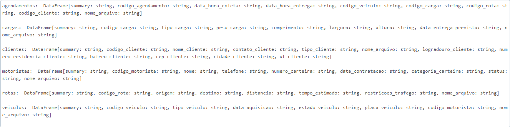
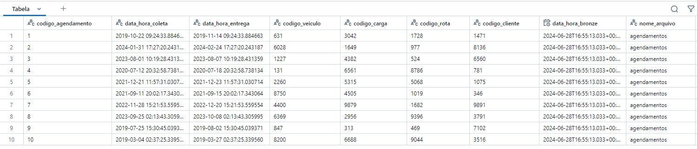

# Camada Silver

A camada Silver é responsável pela limpeza e transformação inicial dos dados brutos da camada Bronze. Aqui, aplicamos filtros, validações e ajustes para garantir que os dados estejam estruturados de maneira consistente e prontos para análises mais complexas. Utilizamos PySpark para processar e manipular os dados nesta etapa.

### Mostrando todos os arquivos da camada bronze

```python
display(dbutils.fs.ls(f"/mnt/{storageAccountName}/bronze"))
```

### Gerando um dataframe dos delta lake no container bronze do Azure Data Lake Storage

```python
df_agendamentos = spark.read.format('delta').load(f"/mnt/{storageAccountName}/bronze/agendamentos")
df_cargas = spark.read.format('delta').load(f"/mnt/{storageAccountName}/bronze/cargas")
df_clientes = spark.read.format('delta').load(f"/mnt/{storageAccountName}/bronze/clientes")
df_motoristas = spark.read.format('delta').load(f"/mnt/{storageAccountName}/bronze/motoristas")
df_rotas = spark.read.format('delta').load(f"/mnt/{storageAccountName}/bronze/rotas")
df_veiculos = spark.read.format('delta').load(f"/mnt/{storageAccountName}/bronze/veiculos")
```

### Adicionando metadados de data e hora de processamento e nome do arquivo de origem

```python
from pyspark.sql.functions import current_timestamp, lit

df_agendamentos   = df_agendamentos.withColumn("data_hora_silver", current_timestamp()).withColumn("nome_arquivo", lit("agendamentos"))
df_cargas     = df_cargas.withColumn("data_hora_silver", current_timestamp()).withColumn("nome_arquivo", lit("cargas"))
df_clientes   = df_clientes.withColumn("data_hora_silver", current_timestamp()).withColumn("nome_arquivo", lit("clientes"))
df_motoristas  = df_motoristas.withColumn("data_hora_silver", current_timestamp()).withColumn("nome_arquivo", lit("motoristas"))
df_rotas    = df_rotas.withColumn("data_hora_silver", current_timestamp()).withColumn("nome_arquivo", lit("rotas"))
df_veiculos     = df_veiculos.withColumn("data_hora_silver", current_timestamp()).withColumn("nome_arquivo", lit("veiculos"))
```

### Mudando as colunas para conter somente letras minúsculas e retirando abreviações
```python
import re

def atualizar_colunas(df):
    colunas = df.columns
    for coluna in colunas:
        if coluna.lower() == coluna:
            continue
        nova_coluna = coluna
        if "ID" in nova_coluna:
            position = nova_coluna.find("ID")
            nova_coluna = "Codigo"+nova_coluna[:position]
        nova_coluna = "_".join(re.findall('[A-Z][^A-Z]*', nova_coluna)).lower()
        df = df.withColumnRenamed(coluna, nova_coluna)
    return df

df_agendamentos = atualizar_colunas(df_agendamentos)
df_cargas = atualizar_colunas(df_cargas)
df_clientes = atualizar_colunas(df_clientes)
df_motoristas = atualizar_colunas(df_motoristas)
df_rotas = atualizar_colunas(df_rotas)
df_veiculos = atualizar_colunas(df_veiculos)
```

### Separando endereço do cliente

```python
import pyspark.pandas as ps
ps.set_option('compute.ops_on_diff_frames', True)

pd_clientes = ps.DataFrame(df_clientes)

def separar_endereco(r):
    endereco = r['endereco_cliente']
    endereco = endereco.split(',')
    if len(endereco) == 4:
        logradouro = endereco[0].strip()
        numero_residencia = endereco[1].strip()
        bairro = endereco[2].strip()
        cep_cidade_uf = endereco[3].strip()
    else:
        logradouro = endereco[0].strip()
        numero_residencia = "S/N"
        bairro = endereco[1].strip()
        cep_cidade_uf = endereco[2].strip()
    
    cep_cidade_uf = cep_cidade_uf.split('/')
    cep_cidade = cep_cidade_uf[0].strip()
    uf = cep_cidade_uf[1].strip()
    cep = cep_cidade.split(' ')[0].strip()
    cep = ''.join(cep.split('-'))
    cidade = cep_cidade[len(cep) + 1:].strip()

    return [logradouro, numero_residencia, bairro, cep, cidade, uf]

endereco = pd_clientes.apply(separar_endereco, axis=1)

endereco_df = ps.DataFrame(endereco.tolist(), columns=['logradouro_cliente', 'numero_residencia_cliente', 'bairro_cliente', 'cep_cliente', 'cidade_cliente', 'uf_cliente'])
pd_clientes = ps.concat([pd_clientes, endereco_df], axis=1)
pd_clientes = pd_clientes.drop(columns="endereco_cliente")
pd_clientes.columns
```

### Padronizando colunas de contato para somente número

```python
def padronizar_contato(r, coluna):
    contato = r[coluna]
    contato = re.sub('[^0-9]', '', contato)
    return contato

pd_clientes["contato_cliente"] = pd_clientes.apply(lambda row: padronizar_contato(row, "contato_cliente"), axis=1)

pd_motoristas = ps.DataFrame(df_motoristas)
pd_motoristas["telefone"] = pd_motoristas.apply(lambda row: padronizar_contato(row, "telefone"), axis=1)
```

### Mudando tempo_estimado para minutos

```python
def tempo_em_minutos(r):
    tempo_estimado = r["tempo_estimado"]
    tempo_estimado = tempo_estimado.split(":")
    horas = int(tempo_estimado[0])
    minutos = int(tempo_estimado[1])
    minutos += horas * 60
    return minutos

pd_rotas = ps.DataFrame(df_rotas)
pd_rotas["tempo_estimado"] = pd_rotas.apply(tempo_em_minutos, axis=1)
df_rotas = pd_rotas.to_spark()
df_rotas.select("tempo_estimado").show(5)
```

### Ajustando tipo dos dados

#### Visualizando tipos

```python
print("agendamentos: ", df_agendamentos.describe(), "\n")
print("cargas: ", df_cargas.describe(), "\n") 
print("clientes: ", df_clientes.describe(), "\n") 
print("motoristas: ", df_motoristas.describe(), "\n") 
print("rotas: ", df_rotas.describe(), "\n") 
print("veiculos: ", df_veiculos.describe(), "\n")
```


### Ajustando Tipagem de Cargas

```python
from pyspark.sql.types import FloatType
df_cargas = df_cargas \
  .withColumn("peso_carga" ,
              df_cargas["peso_carga"]
              .cast(FloatType()))   \
  .withColumn("comprimento",
              df_cargas["comprimento"]
              .cast(FloatType()))    \
  .withColumn("largura"  ,
              df_cargas["largura"]
              .cast(FloatType())) \
  .withColumn("altura"  ,
              df_cargas["altura"]
              .cast(FloatType())) 
```

### Ajustando Tipagem de Rotas

```python
df_rotas = df_rotas \
  .withColumn("distancia" ,
              df_rotas["distancia"]
              .cast(FloatType()))  
```

### Apagando coluna nula do DataFrame Rotas

```python
df_rotas = df_rotas.drop("restricoes_trafego")
df_rotas.columns
```

### Salvando os dataframes em delta lake (formato de arquivo) no data lake (repositorio cloud)

```python
df_agendamentos.write.format('delta').mode("overwrite").option("overwriteSchema", "true").save(f"/mnt/{storageAccountName}/silver/agendamentos"),
df_cargas.write.format('delta').mode("overwrite").option("overwriteSchema", "true").save(f"/mnt/{storageAccountName}/silver/cargas"),
df_clientes.write.format('delta').mode("overwrite").option("overwriteSchema", "true").save(f"/mnt/{storageAccountName}/silver/clientes"),
df_motoristas.write.format('delta').mode("overwrite").option("overwriteSchema", "true").save(f"/mnt/{storageAccountName}/silver/motoristas"),
df_rotas.write.format('delta').mode("overwrite").option("overwriteSchema", "true").save(f"/mnt/{storageAccountName}/silver/rotas"),
df_veiculos.write.format('delta').mode("overwrite").option("overwriteSchema", "true").save(f"/mnt/{storageAccountName}/silver/veiculos")
```

### Verificando os dados gravados em delta na camada silver

```python
display(dbutils.fs.ls(f"/mnt/{storageAccountName}/silver/"))
 ```

### Lendo um exemplo de um delta lake para validar a existencia dos dados e das colunas do metadados

```python
spark.read.format('delta').load(f'/mnt/{storageAccountName}/silver/agendamentos').limit(10).display()
```
